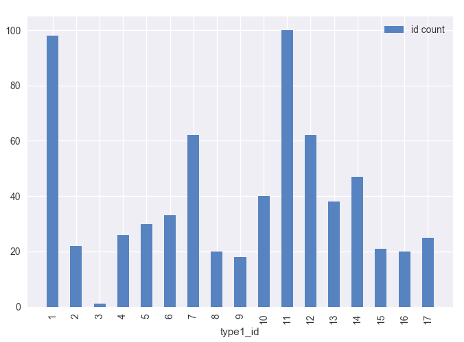
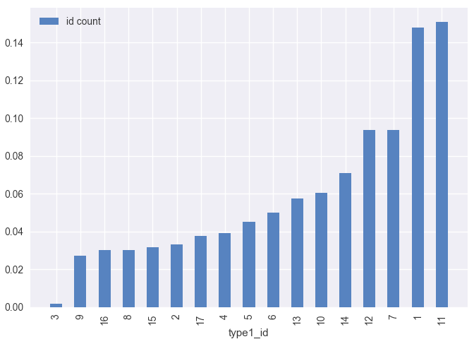
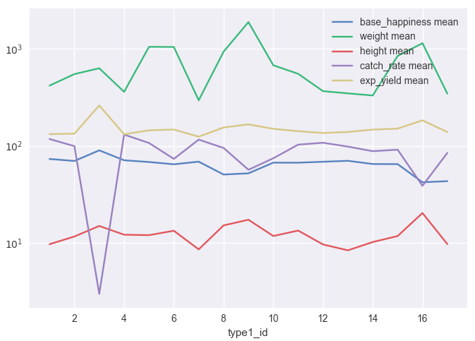
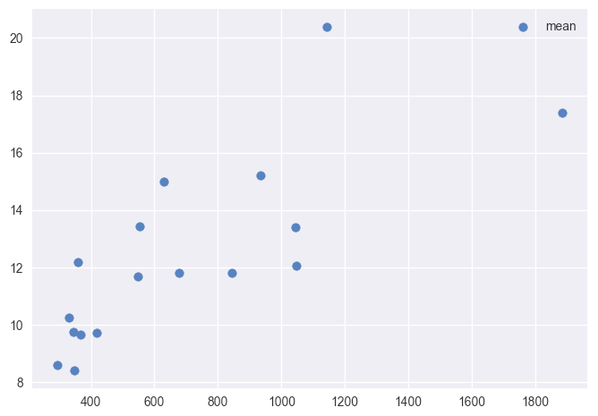
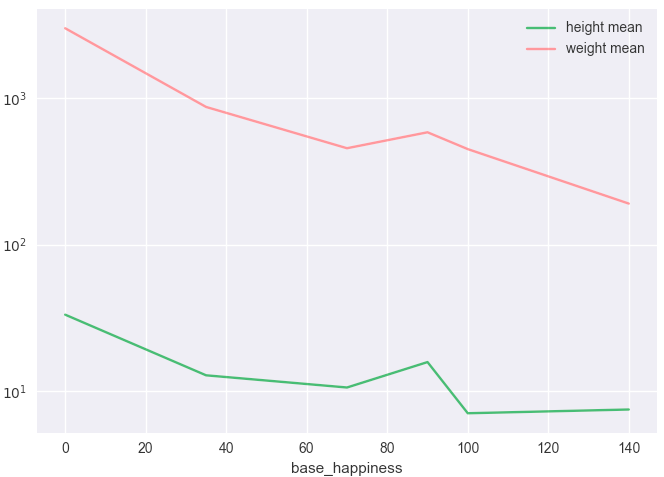
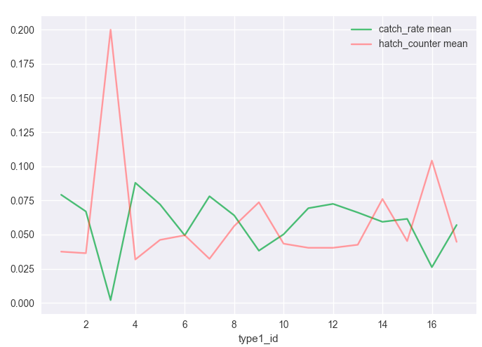

# Задание 1. Ответ.

## Вступление

Привет!  
Во вступительной части хотелось бы сразу сказать, что в jupyter notebook оформить ответы, к сожалению, не удалось. Концепция такого выполнения скриптов для меня осталась тайной и загадочной. Если это повод не принимать ответы, то дальше можно не читать. 

## Поиски

Годы учебы в университете не прошли даром. Увидев набор данных по покемонам я отправился на поиски. Поиски давно забытых и потерянных знаний и поиск хорошей гипотезы, которой я к сожалению так и не нашел :( 

## Статистика

Первое, что приходит в голову, когда видишь большой список непонятных (покемоны прошли мимо меня в свое время) данных - посмотреть на статистику и их распределение. Очевидно, что считать статистику без группировок особого смысла нет, поэтому я попытался выделить какие-то атрибуты, по которым логично группировать данные. Первый же кандидат - type1_id: он у всех заполнен, и количество уникальных записей не столь велико.
Посчитаем и получим такую картинку:

А можно это дело нормировать и посмотреть проценты. Например вот так:

Теперь посчитать среднее по группам. Например, взять следующие атрибуты: weight, height, base\_happiness, catch\_rate и exp_yield и попробовать изобразить их на графике с логарифмической шкалой (иначе weight выбивается)

Судя по графикам, можно предположить, что какие-то величины зависимы (height и weight, например). Посчитаем коэффициент корреляции. Он будет равен 0.7657029716901835, что позволяет говорить о наличии некоторой прямой зависимости между параметрами. Это можно уивдеть на диаграмме рассеивания. Однако, результат вполне ожидаем.

## Выводы

Можно пойти дальше и скриптом группировать по какому-то определенному признаку, 
посчитать корреляции между каждыми парами и смотерть на те, которые скажем больше 0.8. 
Я выбрал произвольный набор группирующих столбцов и также произвольно исключил из расчета неинтересные столбцы
по которым корреляции считать не нужно (всяческие id и  \*dex`ы).
С помощью этих нехитрых манипуляций можем получить примерно вот такую таблицу (приведена не полностью):

| Группирующий атрибут |            Что к чему           |   Коэф. корреляции  |
|----------------------|---------------------------------|---------------------|
| type1\_id            | catch\_rate to exp\_yield       | -0.9054199297190714 |
| type1\_id            | catch\_rate to hatch\_counter   | -0.8865302902155562 |
| type1\_id            | exp\_yield to hatch\_counter    |  0.9795112775727786 |
| type1\_id            | hatch\_counter to exp\_yield    |  0.9795112775727784 |
| color\_id            | exp\_yield to catch\_rate       | -0.8625585056099427 |
| gender\_rate         | exp\_yield to catch\_rate       | -0.8436869026683604 |
| gender\_rate         | exp\_yield to hatch\_counter    |   0.843907617588056 |
| gender\_rate         | exp\_yield to height            |  0.8152620861333304 |
| gender\_rate         | exp\_yield to lvl\_100\_exp     |  0.8615588287739815 |
| gender\_rate         | height to weight                |  0.9226423628246475 |
| gender\_rate         | height to hatch\_counter        |  0.8283623300795137 |
| gender\_rate         | height to lvl\_100\_exp         |  0.8777483485400207 |
| gender\_rate         | height to base\_happiness       | -0.8728162649591126 |
| gender\_rate         | lvl\_100\_exp to exp\_yield     |  0.8615588287739815 |
| gender\_rate         | lvl\_100\_exp to height         |  0.8777483485400206 |
| base\_happiness      | weight to height                |   0.967416558543729 |
| base\_happiness      | weight to gender\_rate          | -0.8368150363983272 |
| base\_happiness      | catch\_rate to exp\_yield       |  -0.936436328245106 |
| base\_happiness      | catch\_rate to hatch\_counter   | -0.9241108820930175 |
| base\_happiness      | exp\_yield to catch\_rate       |  -0.936436328245106 |
| base\_happiness      | exp\_yield to hatch\_counter    |  0.8704754613801508 |
| hatch\_counter       | exp\_yield to catch\_rate       | -0.9235782852828295 |
| hatch\_counter       | gender\_rate to exp\_yield      | -0.9525400362032412 |
| hatch\_counter       | base\_happiness to exp\_yield   |  -0.877383578238367 |
| catch\_rate          | weight to hatch\_counter        |  0.8566656750803773 |
| catch\_rate          | weight to height                |  0.8918243182157759 |
| catch\_rate          | weight to base\_happiness       | -0.8073411412352393 |

Исходя из этого можно делать какие-то выводы. Но какие - придумать не могу.
Например средние рост и вес падают при увеличении счастья. Значит ли это, что покемон тем счастливее, чем ниже? Вероятно да.

Или же связь catch\_rate и hatch\_counter. Получается, что чем ниже catch\_rate, тем выше hatch\_counter и наоборот.

